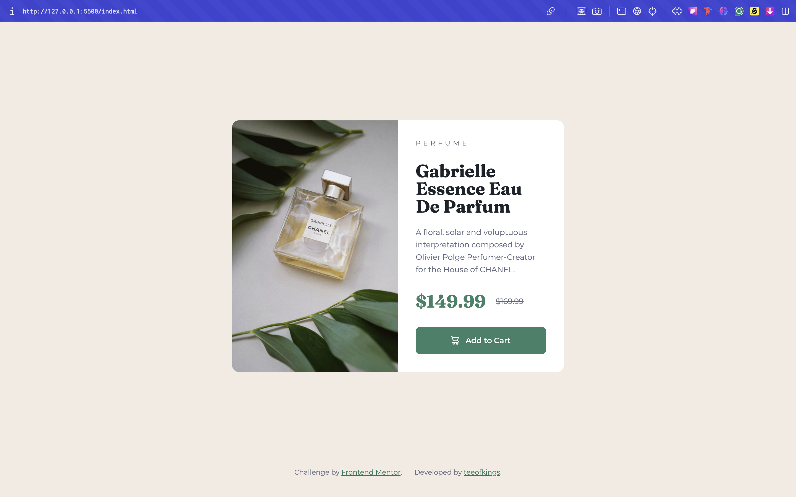

# Frontend Mentor - Product preview card component solution

This is a solution to the [Product preview card component challenge on Frontend Mentor](https://www.frontendmentor.io/challenges/product-preview-card-component-GO7UmttRfa). Frontend Mentor challenges help you improve your coding skills by building realistic projects. 

## Table of contents

- [Overview](#overview)
  - [The challenge](#the-challenge)
  - [Screenshot](#screenshot)
  - [Links](#links)
- [My process](#my-process)
  - [Built with](#built-with)
  - [What I learned](#what-i-learned)
  - [Continued development](#continued-development)
- [Author](#author)

## Overview

### The challenge

Users should be able to:

- View the optimal layout depending on their device's screen size
- See hover and focus states for interactive elements

### Screenshot

### Links

- Solution URL: [Add solution URL here](https://www.frontendmentor.io/solutions/product-preview-card-bXCLylFW2P)
- Live Site URL: (https://product-preview-card-component-xi-gray.vercel.app/)

## My process

### Built with

- HTML
- CSS

### What I learned

- Learnt how to make use of the <picture> tag
- Improved my approach to responsive designs...

### Continued development

Will refesh my Javascript lessons and learn more stuff going forward while trying to finish my Learning path on frontend mentor.

## Author

- Website - [Timothy Ezeigbo]
- Frontend Mentor - [@teeofkings](https://www.frontendmentor.io/profile/teeofkings)
- Twitter - [@teeofkings](https://www.twitter.com/teeofkings)

